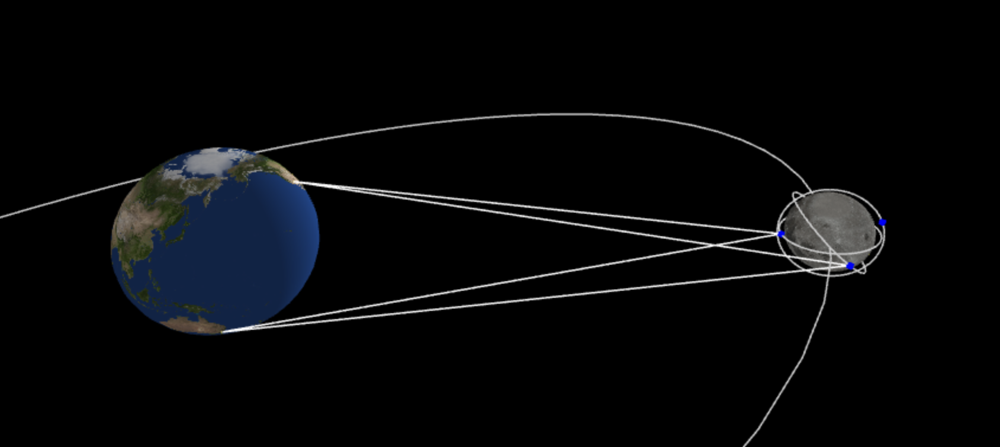

# SPACENET


SPACENET computes communication contact schedules between spacecraft and ground stations using Keplerian orbital dynamics. It models Earth’s rotation and lunar motion to predict line-of-sight access intervals, supporting delay-tolerant networking (DTN) protocol testing and routing validation.




# Installation

1. The software operates within any modern web browser. To serve the files locally, install a lightweight web server such as [https://nodejs.org/en/download](nodejs/npx):

2. Download the source code from GitHub:

```
git clone https://github.com/riclent/spacenet.git
```

3. Navigate into the project directory and launch the server:

```
cd spacenet
test/run.sh
```

or  `test\run.bat` on Windows. A browser window will open displaying the system visualization.

4. Simulation controls:

- Press `<space>` to start/pause the simulation. 
- Right-click and drag: pan the view.
- Left-click and drag: rotate the system.
- Scroll wheel: zoom in/out.

4. The contact list appears below the system visualization. Click the time label at the bottom of the screen, then scroll down to see the contacts.


# Running your own scenarios

To customize simulation parameters, edit the configuration file: `spacenet/conf/config.json`.

The fields are designed to be self-explanatory. Modify them as needed to define spacecraft orbits, ground station locations, and simulation timelines.

# Supporting files

All files located under `spacenet/js` were developed by other contributors and included here to ensure the package is fully self-contained. 


# Credits

If you find this software useful, please considering citing the paper: 

```
R. Lent, “Enhanced path reliability of Contact Graph Routing through a cognitive extension (Best Paper Award),” in The Sixteenth International Conference on Advances in Satellite and Space Communications (SPACOMM 2024), June 2024.
```
